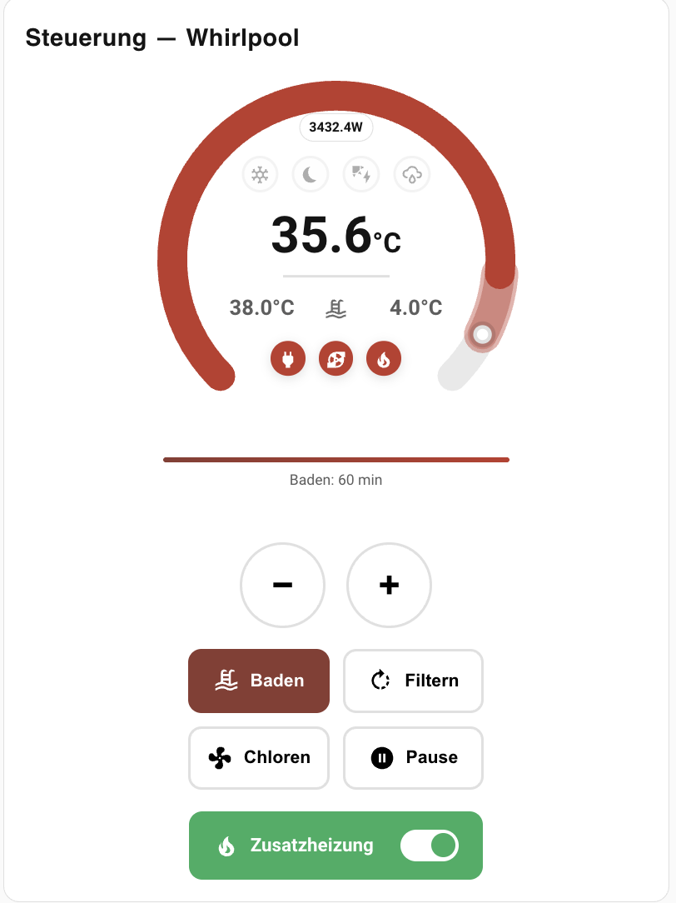
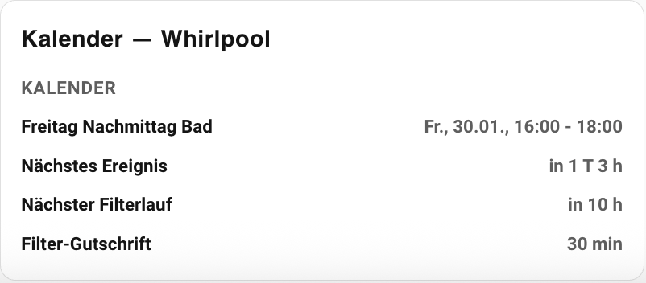
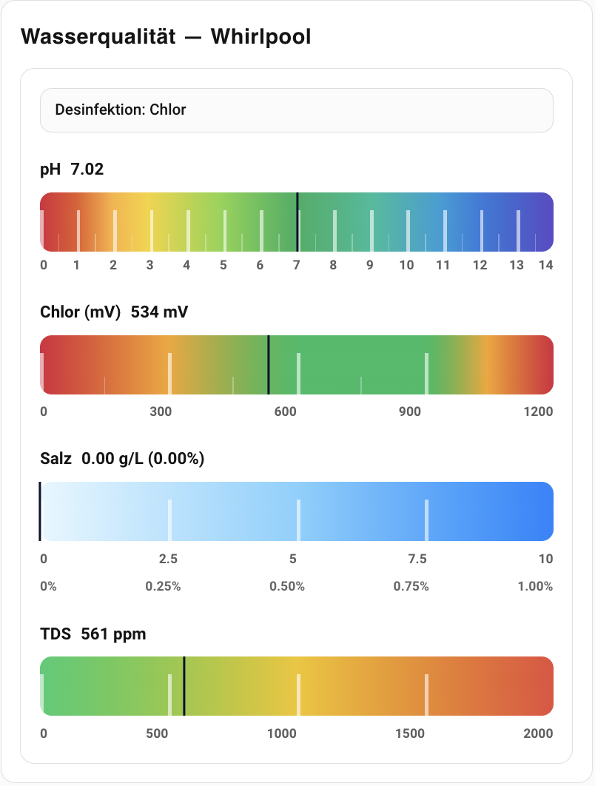
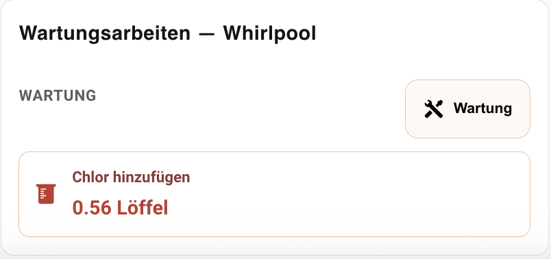

# Pool Controller Dashboard (Frontend)

Lovelace custom card (frontend UI) for the Home Assistant integration **pool_controller**.

- Backend integration: https://github.com/lweberru/pool_controller
- This repository (HACS frontend plugin): ships the single-file resource `main.js`

## Screenshot


## Features (high level)

- Thermostat-style dial (current/target temperature)
- Target temperature control via ring (click/drag) and via `+` / `−`
- Quick actions: **Bathing**, **Filtering**, **Chlorine**, **Pause**
- Optional AUX heater toggle
- Status indicators: Frost protection, Quiet hours, PV surplus
- Outdoor temperature display
- Next frost protection run countdown
- Transparency: shows “why” via Heat Reason / Run Reason (icon between target temp and outdoor temp)
- Physical switch state row: shows if main/pump/aux switches are actually ON
- Maintenance mode warning banner (disables automation incl. frost protection)
- Sanitizer mode badge (chlorine / saltwater / mixed)
- Water quality: pH, ORP/Chlorine (mV), Salt (g/L + %) and TDS (ppm)
- Maintenance hints (dosing + salt + water change recommendation for high TDS)
- Runtime auto-discovery from the entity registry (YAML-friendly)

## Installation (HACS)

1. In HACS → **Custom repositories** add this repo (Category: **Lovelace**)
2. Install
3. Ensure the resource is registered as a **JavaScript Module**:
	- `/hacsfiles/pool_controller_dashboard_frontend/main.js`

Note: HACS usually adds the resource automatically.

## Installation (manual)

1. Copy `main.js` to `config/www/pool_controller_dashboard_frontend/`
2. In Home Assistant go to **Settings → Dashboards → Resources** and add as module:
	- `/local/pool_controller_dashboard_frontend/main.js`

## Add the card (UI editor)

Recommended path:

1. Open your dashboard → **Edit dashboard**
2. **Add card** → search for “Pool Controller” (custom card)
3. In the card editor select your Pool Controller instance (the `climate.*` entity from `pool_controller`)
4. The card stores only the selected **device** (or climate entity) and the chosen **content**

## Add the card (YAML)

```yaml
type: custom:pc-pool-controller
device_id: 0123456789abcdef0123456789abcdef
# optional alternative:
# climate_entity: climate.my_pool
content: controller
```

### Does auto-discovery work without using the UI editor?

Yes. The card always derives all related entities from the entity registry at runtime. YAML-only with `type` + `device_id` (or `climate_entity`) is enough to get the full UI.

## Kartenvarianten (content)

Die Karte hat vier feste Varianten. Stelle sie über den Parameter `content` ein:

### 1) Controller-Karte

```
content: controller
```

Zeigt den Temperatur‑Dial, Aktionen (Baden/Filtern/Chloren/Pause), Status‑Icons, Schalter‑Status und die Heiz‑/Lauf‑Gründe.



### 2) Kalender-Karte

```
content: calendar
```

Zeigt die nächste Kalender‑Session inkl. Start/Ende, Countdown bis zum Start, nächsten Filterlauf, nächsten Frostlauf sowie Gutschriften.



### 3) Wasserqualität-Karte

```
content: waterquality
```

Zeigt pH, ORP/Chlor (mV), Salz (g/L + %) und TDS (ppm) inklusive Status‑Bewertung.



### 4) Wartung-Karte

```
content: maintenance
```

Zeigt konkrete Wartungs‑Hinweise (z. B. pH+/pH‑, Salz‑Nachfüllung, Wasserwechsel, Chlor‑Dosis).



## How to use / meaning of elements

### Temperature dial (left)

- Big number: **current temperature** (measured water temperature)
- Smaller value: **target temperature**
- Dial ring:
	- Progress arc shows current temperature relative to the configured min/max
	- Target marker shows the target temperature
	- Click/drag on the ring sets the target temperature (calls `climate.set_temperature` on release)
- `+` / `−` buttons: change target temperature (calls `climate.set_temperature`)

Note: If the backend `climate.*` entity exposes `min_temp`, `max_temp` and `target_temp_step`, the card uses those values automatically.

### Status icons (inside the dial)

- Frost: frost danger detected (by default mapped to `binary_sensor.*_frost_danger`; you can also map to `*_frost_active` if you prefer the duty-cycle state). Click opens the frost sensor more-info when available (fallback: Run Reason).
- Moon: quiet hours active
- Solar: PV surplus allows heating/filtering

### Reason icon + physical switch icons (inside the dial)

- Mid icon (between target temperature and outdoor temperature):
	- Shows *why heating is allowed* (Heat Reason) or *why the pool is running* (Run Reason)
	- Tooltip explains the reason; click opens more-info for the underlying sensor
- Row below: shows the **physical** switch states (mirrors from the backend)
	- Main power (plug)
	- Pump
	- Aux heater (fire)

### Maintenance mode

When `binary_sensor.*_maintenance_active` is `on`, the card shows a prominent warning banner.

Important: maintenance mode is a hard lockout in the backend and disables automation, including frost protection.

### Actions

- **Bathing**: start/stop bathing mode
- **Filtering**: start/stop filter cycle
- **Chlorine**: start/stop quick chlorine
- **Pause**: pause automation

The card calls the `pool_controller` services (`start_*` / `stop_*`) and includes `climate_entity` in the payload so multi-instance setups are routed correctly.

### AUX heater

- “Additional heater”: toggles the AUX heater (if configured)

### Upcoming

The “Next event” block shows:

- Next calendar event (start/end/summary)
- Next filter cycle (“Next filter cycle in …”)
- Next frost protection run (“Next frost protection in …”)

## Water quality (right)

The card shows a small “Sanitizer” badge (derived from `sensor.*_sanitizer_mode`).
For saltwater/mixed systems the backend provides `tds_effective` (effective/non-salt TDS); the card prefers that value.

- **pH**: scale 0–14
- **Chlorine/ORP**: shown in mV (scale 0–1200)
- **Salt** (optional): shown as g/L plus percent (g/L × 0.1 = %)
- **TDS** (optional): shown in ppm

Salt and TDS bars are rendered whenever the sensors are available (including a value of 0).

## Maintenance

The “Maintenance” section appears when the backend recommends an action, e.g.:

- Add pH+ / pH-
- Add chlorine
- Add salt (saltwater/mixed mode): based on `sensor.*_salt_add_g` (grams of salt to add)
- Water change (when TDS is high; based on backend recommendation: percent and optionally liters)

## Configuration

Required (one of):

- `device_id` (recommended)
- `climate_entity`

Optional:

- `content`: one of `controller`, `calendar`, `waterquality`, `maintenance` (default: `controller`)

All other entities are derived automatically from the entity registry at runtime.

## Troubleshooting

- After updates: hard reload the browser (Ctrl+F5) and/or clear the HA frontend cache.

## Contributing

Development rules and release workflow (HACS via GitHub Releases): see [CONTRIBUTING.md](CONTRIBUTING.md).
