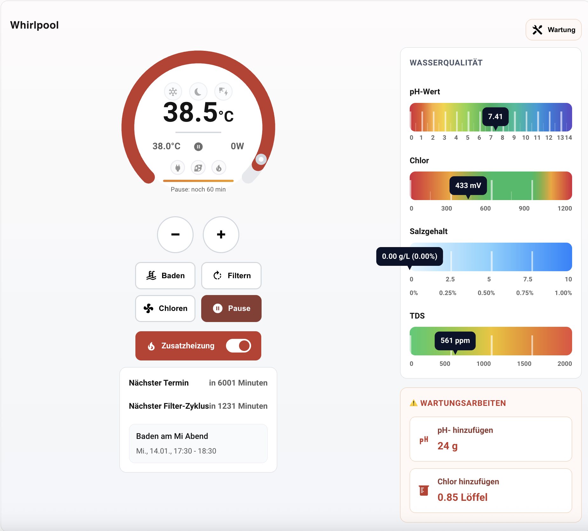

# Pool Controller Dashboard (Frontend)

Lovelace custom card (frontend UI) for the Home Assistant integration **pool_controller**.

- Backend integration: https://github.com/lweberru/pool_controller
- This repository (HACS frontend plugin): ships the single-file resource `main.js`

## Screenshot



## Features (high level)

- Thermostat-style dial (current/target temperature)
- Target temperature control via ring (click/drag) and via `+` / `−`
- Quick actions: **Bathing**, **Filtering**, **Chlorine**, **Pause**
- Optional AUX heater toggle
- Status indicators: Frost protection, Quiet hours, PV surplus
- Maintenance mode warning banner (disables automation incl. frost protection)
- Water quality: pH, ORP/Chlorine (mV), optional Salt (g/L + %) and TDS (ppm)
- Maintenance hints (dosing + water change recommendation for high TDS)
- Runtime auto-discovery from the entity registry (YAML-friendly)

## Installation (HACS)

1. In HACS → **Custom repositories** add this repo (Category: **Plugin**)
2. Install
3. Ensure the resource is registered as a **JavaScript Module**:
	- `/hacsfiles/pool_controller_dashboard_frontend/main.js`

Note: HACS usually adds the resource automatically.

## Installation (manual)

1. Copy `main.js` to `config/www/pool_controller_dashboard_frontend/`
2. In Home Assistant go to **Settings → Dashboards → Resources** and add as module:
	- `/local/pool_controller_dashboard_frontend/main.js`

## Add the card (UI editor)

Recommended path (because it auto-maps most entities):

1. Open your dashboard → **Edit dashboard**
2. **Add card** → search for “Pool Controller” (custom card)
3. In the card editor select your Pool Controller instance (the `climate.*` entity from `pool_controller`)
4. The editor will auto-fill related entities (buttons/sensors/binary_sensors) from the same config entry

## Add the card (YAML)

```yaml
type: custom:pc-pool-controller
climate_entity: climate.my_pool
```

### Does auto-discovery work without using the UI editor?

Yes (with one requirement):

- If `climate_entity` belongs to a `pool_controller` config entry, the card derives the related entities from the entity registry at runtime.
- This means YAML-only with `type` + `climate_entity` is typically enough to get the full UI (actions, timers, water quality, maintenance).

If entity registry access is blocked/unavailable, only explicitly configured entities will work.

## How to use / meaning of elements

### Temperature dial (left)

- Big number: **current temperature** (measured water temperature)
- Smaller value: **target temperature**
- Dial ring:
	- Progress arc shows current temperature relative to the configured min/max
	- Target marker shows the target temperature
	- Click/drag on the ring sets the target temperature (calls `climate.set_temperature` on release)
- `+` / `−` buttons: change target temperature (calls `climate.set_temperature`)

Note: If the backend `climate.*` entity exposes `min_temp`, `max_temp` and `target_temp_step`, the card uses those values automatically. The config keys `min_temp`, `max_temp` and `step` remain as a fallback.

### Status icons (inside the dial)

- Frost: frost danger detected (by default mapped to `binary_sensor.*_frost_danger`; you can also map to `*_frost_active` if you prefer the duty-cycle state)
- Moon: quiet hours active
- Solar: PV surplus allows heating/filtering

### Maintenance mode (Wartung)

If the backend exposes `binary_sensor.*_maintenance_active` and it is `on`, the card shows a prominent warning banner.

Important: maintenance mode is a hard lockout in the backend and disables automation, including frost protection.

### Actions

- **Bathing**: start/stop bathing mode
- **Filtering**: start/stop filter cycle
- **Chlorine**: start/stop quick chlorine
- **Pause**: pause automation

The card prefers calling the `pool_controller` services (`start_*` / `stop_*`) and includes `climate_entity` in the payload so multi-instance setups are routed correctly. If the services are not available (older backend), it falls back to entity triggers (`button.press`, `switch.turn_on/off`, `input_boolean.turn_on/off`).

### AUX heater

- “Additional heater”: toggles the AUX heater (if configured)

### Upcoming

An optional “Next event” block is shown when the backend provides the corresponding sensors:

- Next calendar event (start/end/summary)
- Next filter cycle (“Next filter cycle in …”)

## Water quality (right)

- **pH**: scale 0–14
- **Chlorine/ORP**: shown in mV (scale 0–1200)
- **Salt** (optional): shown as g/L plus percent (g/L × 0.1 = %)
- **TDS** (optional): shown in ppm

Salt and TDS bars are rendered when the values are available as sensors (including a value of 0).

## Maintenance

The “Maintenance” section appears when the backend recommends an action, e.g.:

- Add pH+ / pH-
- Add chlorine
- Water change (when TDS is high; based on backend recommendation: percent and optionally liters)

## Configuration (key overview)

Required:

- `climate_entity`

Common optional keys (usually filled by the UI editor auto-mapping):

- `aux_entity`
- `maintenance_entity` (recommended; usually derived automatically)
- `manual_timer_entity` (shared manual timer; attributes: `active`, `duration_minutes`, `type`)
- `auto_filter_timer_entity`
- `pause_timer_entity`
- `ph_entity`, `chlorine_value_entity`, `salt_entity`, `tds_entity`
- `tds_assessment_entity`, `water_change_percent_entity`, `water_change_liters_entity`

Legacy (older backend, still supported as fallback):

- `bathing_start`, `bathing_stop`, `bathing_until`, `bathing_active_binary`
- `filter_start`, `filter_stop`, `filter_until`, `next_filter_in`
- `chlorine_start`, `chlorine_stop`, `chlorine_until`, `chlorine_active_entity`
- `pause_start`, `pause_stop`, `pause_until`, `pause_active_entity`

## Troubleshooting

- After updates: hard reload the browser (Ctrl+F5) and/or clear the HA frontend cache.
- If auto-discovery does not work: verify `climate_entity` is the `pool_controller` climate entity and that the frontend can access the entity registry.

## Contributing

Development rules and release workflow (HACS via GitHub Releases): see [CONTRIBUTING.md](CONTRIBUTING.md).
