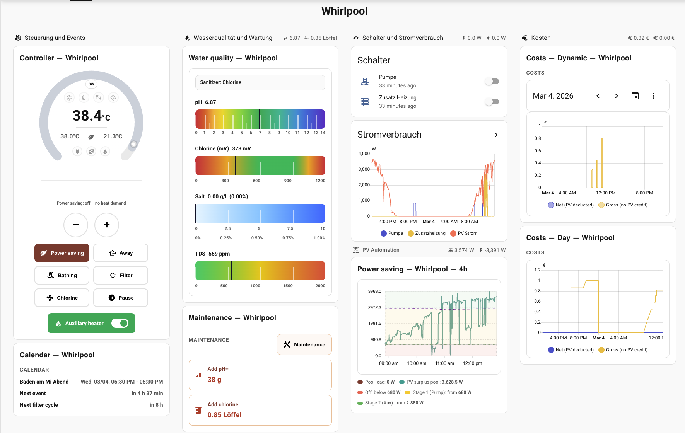
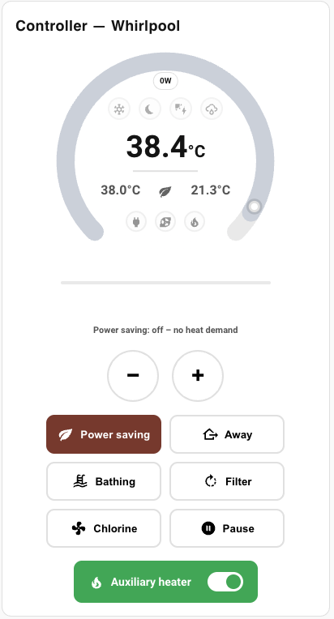
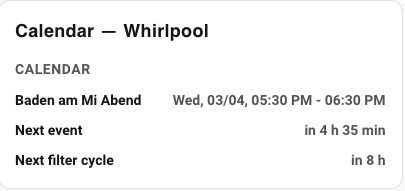
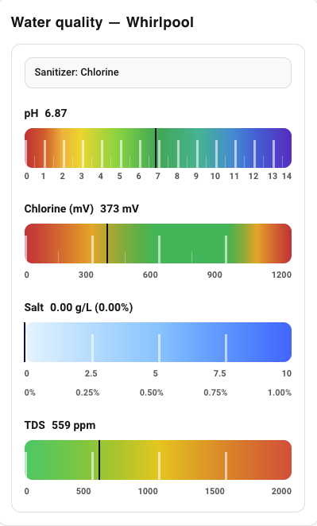
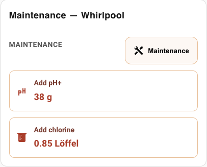
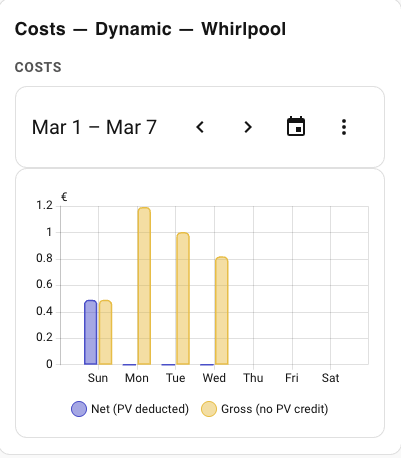
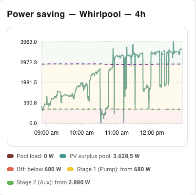
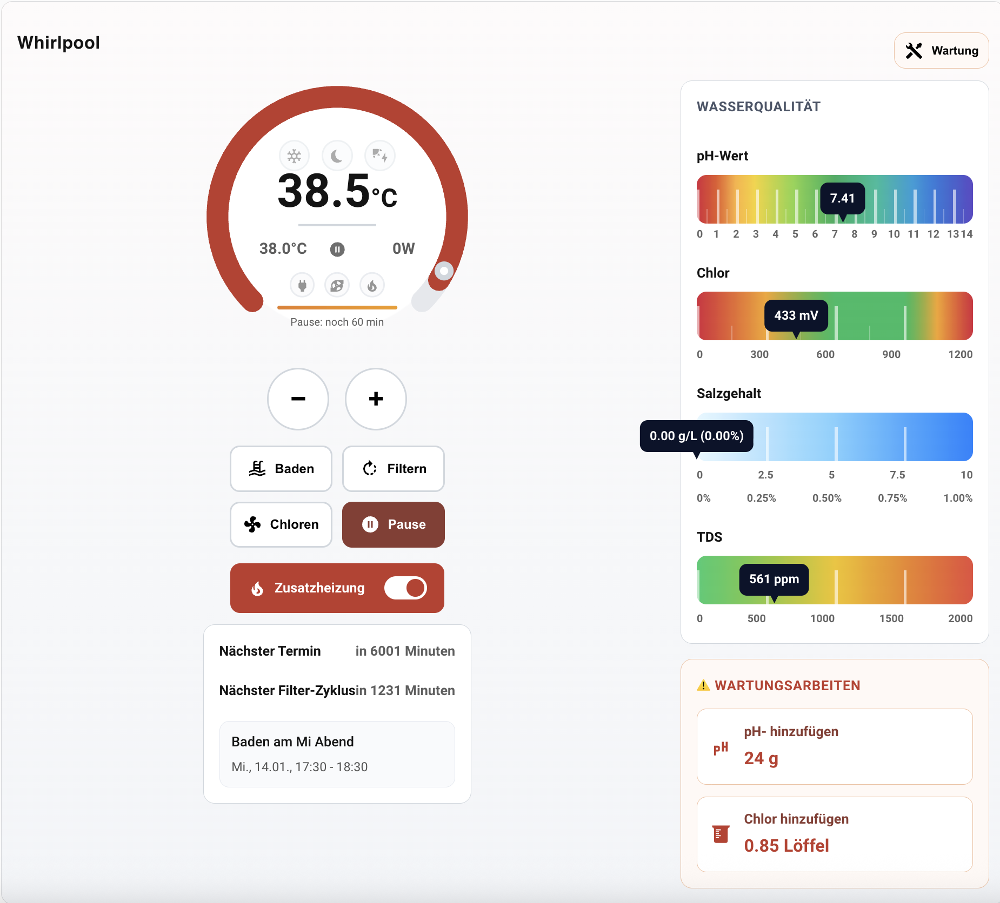

# Pool Controller Dashboard Frontend

Lovelace Custom Card for the Home Assistant integration `pool_controller`.

- Backend integration: https://github.com/lweberru/pool_controller
- This repository provides the frontend as a single-file plugin: `main.js`
- Card type: `custom:pc-pool-controller`

## Prerequisites

- Home Assistant with the backend integration `pool_controller` installed
- For `content: cost` and `content: pv`: `custom:apexcharts-card` must be available

## Screenshots

### Full Dashboard



### Individual Cards / Blocks

#### Controller (`content: controller`)


#### Calendar (`content: calendar`)


#### Water Quality (`content: waterquality`)


#### Maintenance (`content: maintenance`)


#### Costs (`content: cost`)


#### PV & Power Saving (`content: pv`)


### Additional Views




## Installation (HACS)

1. HACS → **Custom repositories** → add this repository (category **Lovelace**)
2. Install the repository
3. Verify that the resource is loaded as a JavaScript module:
   - `/hacsfiles/pool_controller_dashboard_frontend/main.js`

Note: HACS usually creates the resource entry automatically.

## Installation (Manual)

1. Copy `main.js` to `config/www/pool_controller_dashboard_frontend/`
2. In Home Assistant under **Settings → Dashboards → Resources**, add it as a module:
   - `/local/pool_controller_dashboard_frontend/main.js`

## Quick Start (YAML)

```yaml
type: custom:pc-pool-controller
device_id: 0123456789abcdef0123456789abcdef
# alternative:
# climate_entity: climate.my_pool
content: controller
```

The card is YAML-first: with `device_id` (or `climate_entity`), auto-discovery of all related sensors/switches works via the entity registry.

## Content Modes (`content`)

The card supports these modes:

- `controller`
- `calendar`
- `waterquality`
- `maintenance`
- `cost`
- `pv`

## Key Features

- Temperature dial with drag/click + `+` / `−`
- Actions: Bathe, Filter, Chlorine, Pause
- Maintenance mode with visible lockout
- Heat/run reason shown transparently in the UI
- Entity auto-discovery (minimal YAML effort)
- Cost and PV visualization via ApexCharts
- Click-to-open more-info (`hass-more-info`) on key data points

## Clickable Information (More-Info)

Many UI elements directly open the matching sensor/switch in Home Assistant, including:

- Status/switch icons in the controller block
- Values in the water quality block
- Entries in calendar/upcoming
- Maintenance recommendations
- PV legend entries

## Service Behavior

The card primarily uses `pool_controller` services (`start_*` / `stop_*`).
If needed, it falls back to climate/buttons/switches to keep workflows robust.

## Editor Usage

1. Edit your dashboard
2. **Add card** → “Pool Controller”
3. Select the controller instance
4. Set the desired `content` mode

## Configuration

### Required Field (one of these)

- `device_id` (recommended)
- `climate_entity`

### Optional Fields

- `content`: see mode list above (default: `controller`)
- Additional display options depending on mode (for example Cost/PV in editor)

All remaining entity mappings are derived automatically from the registry.

## Troubleshooting

- After an update: hard-reload the browser (`Ctrl+F5`) and clear cache if needed
- Check browser console for the loaded version:
  - `[pool_controller_dashboard_frontend] loaded vX.Y.Z`
- If `cost`/`pv` stays empty: verify `custom:apexcharts-card` is installed

## Development & Contributing

- No build pipeline/dependencies: all frontend changes are in `main.js`
- i18n is handled via the internal `I18N` object
- Guidelines and workflow: [CONTRIBUTING.md](CONTRIBUTING.md)

## Release Note

HACS updates are release-based (GitHub release/tag). Make sure to bump `VERSION` in `main.js` to match the release version.
